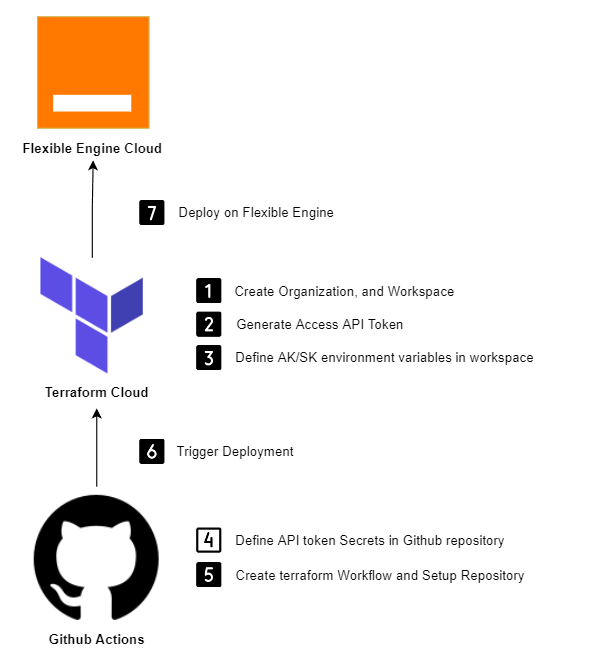
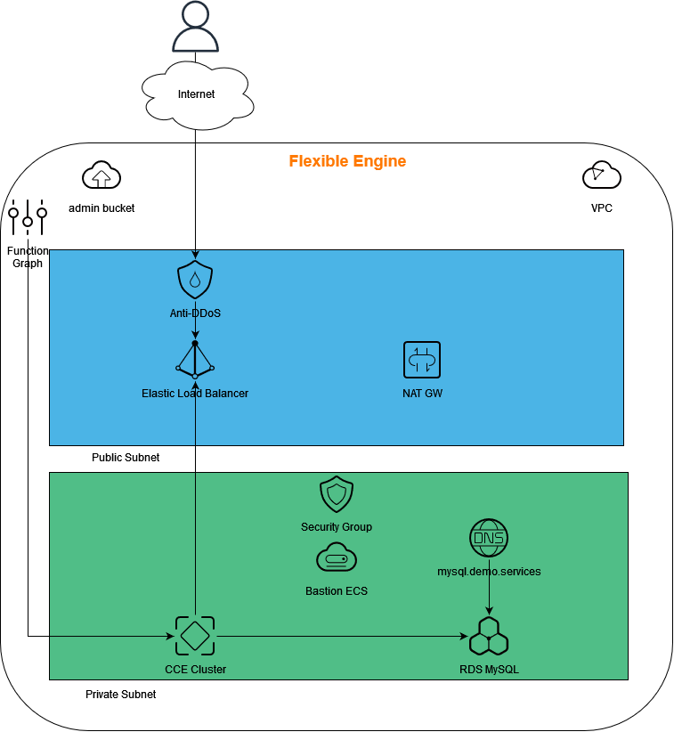

# Description

In this repository you will find an example of deployment of the following resources with Terraform and the Flexible Engine provider :

- 1 Object Storage Buckets to store logs

- 1 KeyPair (to ressources securely)

- 1 VPC (10.0.0.0/16)

  - Router
  - Subnet : 10.0.1.0/24
  - NAT Gateway 
    - an SNAT rule : to allow CCE nodes to access internet and pull docker images
  - Elastic Load Balancer
    - 1 Public IP
  - Anti DDoS to protect Elastic Load Balancer public IP
  - Bastion server (to access infrastructure)
    - 1 EIP
  - Security Group
    - Security Inbound rule : to access ssh on xxxx port
    - allow only IP x.x.x.x

  - Cloud Container Engine Cluster (CCE - Kubernetes version 1.23)
    - a CCE Node Pool with 1 node
  - Relational Database Service (RDS) MySQL : to store application data

- 1 Function As a Service to Hibernate CCE cluster through API call

# Workflow

#### **Terraform Cloud:**

For this demonstration we will use **Terraform Cloud** which is HashiCorp’s managed service. 

That will provision infrastructure in a remote environment that is optimized for the **Terraform workflow**.

**Terraform Cloud** enables infrastructure automation for provisioning, compliance, and management of any cloud, data center, and service.

#### **GitHub Actions:**

Terraform CLI or Terraform console can be used to deploy infrastructures locally.

This may work for a while if you are a single team member, if your teams  grow it will be crucial to centralize deployment for all team members to have visibility, control and rollback. 

**GitHub Actions** is a continuous integration and continuous delivery (CI/CD) platform that allows to automate your build, test, and deployment pipeline. You  can create workflows that build and test every pull request to your  repository or deploy merged pull requests to production.

# Schema

